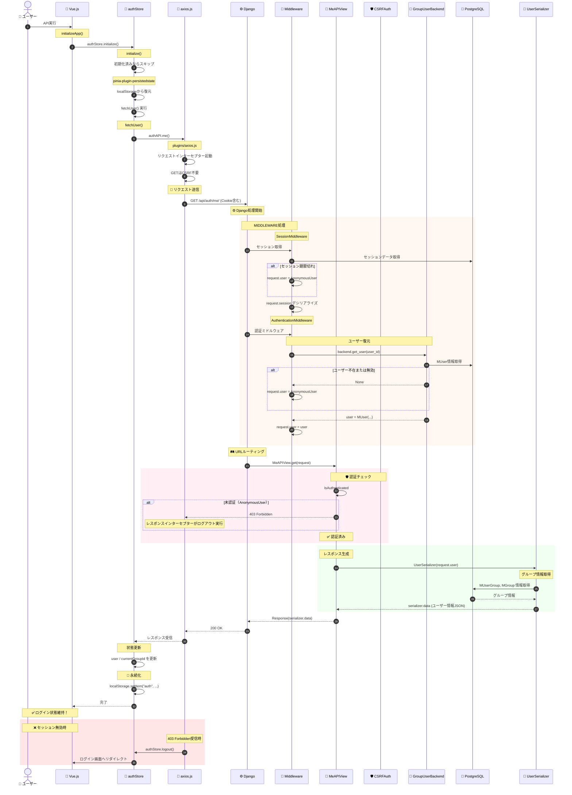

```mermaid
sequenceDiagram
    autonumber
    actor User as 👤 ユーザー
    participant Vue as 🎨 Vue.js
    participant Store as 💾 authStore
    participant Axios as 📡 axios.js
    participant Django as ⚙️ Django
    participant Middleware as 🔄 Middleware
    participant View as 📍 MeAPIView
    participant CSRF as 🛡️ CSRFAuth
    participant Backend as 🎯 GroupUserBackend
    participant DB as 💾 PostgreSQL
    participant Serializer as 📝 UserSerializer

    User->>Vue: API実行

    Note over Vue: initializeApp()
    Vue->>Store: authStore.initialize()

    Note over Store: initialize()
    Store->>Store: 初期化済みならスキップ

    Note over Store: pinia-plugin-persistedstate
    Store->>Store: localStorageから復元

    Store->>Store: fetchUser() 実行

    Note over Store: fetchUser()
    Store->>Axios: authAPI.me()

    Note over Axios: plugins/axios.js
    Axios->>Axios: リクエストインターセプター起動
    Axios->>Axios: GETはCSRF不要

    Note over Axios: 📡 リクエスト送信
    Axios->>Django: GET /api/auth/me/ (Cookie含む)

    Note over Django: ⚙️ Django処理開始

    rect rgb(255, 248, 240)
        Note over Django,Middleware: MIDDLEWARE処理

        Note over Middleware: SessionMiddleware
        Django->>Middleware: セッション取得
        Middleware->>DB: セッションデータ取得

        alt セッション期限切れ
            Middleware->>Middleware: request.user = AnonymousUser
        end

        Middleware->>Middleware: request.session デシリアライズ

        Note over Middleware: AuthenticationMiddleware
        Django->>Middleware: 認証ミドルウェア

        Note over Middleware,Backend: ユーザー復元
        Middleware->>Backend: backend.get_user(user_id)

        Backend->>DB: MUser情報取得

        alt ユーザー不在または無効
            Backend-->>Middleware: None
            Middleware->>Middleware: request.user = AnonymousUser
        end

        Backend-->>Middleware: user = MUser(...)
        Middleware->>Middleware: request.user = user
    end

    Note over Django: 🛤️ URLルーティング
    Django->>View: MeAPIView.get(request)

    rect rgb(255, 240, 245)
        Note over View,CSRF: 🛡️ 認証チェック
        View->>View: IsAuthenticated

        alt 未認証（AnonymousUser）
            View-->>Axios: 403 Forbidden
            Note over Axios: レスポンスインターセプターがログアウト実行
        end

        Note over View: ✅ 認証済み
    end

    rect rgb(240, 255, 240)
        Note over View: レスポンス生成
        View->>Serializer: UserSerializer(request.user)

        Note over Serializer: グループ情報取得
        Serializer->>DB: MUserGroup, MGroup 情報取得

        DB-->>Serializer: グループ情報

        Serializer-->>View: serializer.data (ユーザー情報JSON)
    end

    View-->>Django: Response(serializer.data)
    Django-->>Axios: 200 OK

    Axios-->>Store: レスポンス受信

    Note over Store: 状態更新
    Store->>Store: user / currentGroupId を更新

    Note over Store: 💾 永続化
    Store->>Store: localStorage.setItem("auth", ...)

    Store-->>Vue: 完了

    Note over User,Vue: ✅ ログイン状態維持！

    rect rgb(255, 230, 230)
        Note over User,Vue: ❌ セッション無効時
        Note over Axios: 403 Forbidden受信時
        Axios->>Store: authStore.logout()
        Store->>Vue: ログイン画面へリダイレクト
    end
```
