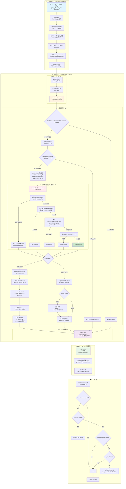

```mermaid
flowchart TB
    subgraph Frontend["🎨 フロントエンド（Vue.js 3.x + Pinia）"]
    A[ユーザー: ログインフォーム入力<br />group_id + user_id + password]
    A --> B[Login.vue<br />fetchGroups実行]
    B --> C[api.get auth/groups/<br />グループ一覧取得]
    C --> D[CSRFトークン自動取得<br />axios interceptor]
    D --> E[ログインボタンクリック<br />onSubmit]
    E --> F[authStore.loginSession<br />groupId, userId, password]
    F --> G[authAPI.login<br />POST /api/auth/login/]
    end

    subgraph Backend["⚙️ バックエンド（Django 5.2 + DRF）"]
    direction TB

        subgraph Entry["📍 エントリーポイント"]
        H[config/urls.py<br />path api/auth/]
        H --> I[accounts/urls.py<br />path login/]
        I --> J[accounts/views.py<br />LoginAPIView.post]
        end

        subgraph AuthFlow["🔐 認証処理フロー"]
        J --> K{CSRFEnforcedSessionAuthentication<br />CSRF検証}
        K -->|❌ CSRF無効| K1[403 Forbidden]
        K -->|✅ CSRF有効| L[LoginSerializer<br />バリデーション]

        L --> M{LoginAttemptService<br />ロックチェック}
        M -->|🔒 ロック中| M1[429 Too Many Requests]
        M -->|✅ ロック解除| N[authenticate呼び出し<br />username=user_id<br />password=password<br />group_id=group_id]

        N --> O[GroupUserAuthBackend<br />authenticate]

            subgraph CustomAuth["🎯 カスタム認証バックエンド"]
            O --> P1[1️⃣ User.objects.filter<br />user_id=user_id.first]
            P1 -->|user is None| P2[タイミング攻撃対策<br />User.set_password]
            P1 -->|user exists| P3[2️⃣ user.check_password<br />パスワードハッシュ検証]

            P3 -->|❌ 不一致| P4[return None]
            P3 -->|✅ 一致| P5[3️⃣ MUserGroup.objects.filter<br />user_id, group_id, is_active=True.exists]

            P5 -->|❌ 所属なし| P6[return None]
            P5 -->|✅ 所属確認| P7[4️⃣ user.is_active チェック]

            P7 -->|❌ 無効| P8[return None]
            P7 -->|✅ 有効| P9[✨ return user]
            end

        P2 --> Q{認証結果判定}
        P4 --> Q
        P6 --> Q
        P8 --> Q
        P9 --> Q

        Q -->|user is None| R[LoginAttemptService<br />increment_attempts]
        R --> S{should_lock?}
        S -->|✅ Yes| T[lock_user<br />監査ログ: ACCOUNT_LOCKED]
        T --> U[401 Unauthorized<br />detail: ログイン失敗]
        S -->|❌ No| U

        Q -->|user exists| V[LoginAttemptService<br />reset_attempts]
        V --> W[login request, user<br />Djangoセッション作成]
        W --> X[request.session<br />current_group_id = group_id]
        X --> Y[監査ログ: LOGIN_SUCCESS]
        Y --> Z[UserSerializer<br />is_admin計算<br />current_group取得]
        end

        subgraph Response["📤 レスポンス生成"]
        Z --> AA[Response<br />detail: logged_in<br />user: ユーザー情報JSON]
        U --> AA
        M1 --> AA
        K1 --> AA
        end
    end

    subgraph FrontendStore["💾 フロントエンド: 状態管理"]
    AA --> AB[authStore<br />user保存<br />currentGroupId保存]
    AB --> AC[localStorage自動保存<br />pinia-plugin-persistedstate]
    AC --> AD[router.push<br />ROUTE_NAMES.HOME]
    end

    subgraph RouterGuard["🛡️ ルーターガード"]
    AD --> AE[router.beforeEach<br />auth-guard.js]
    AE --> AF{to.meta.requiresAuth?}
    AF -->|No| AG[next]
    AF -->|Yes| AH{auth.user exists?}
    AH -->|No| AI[redirect to LOGIN]
    AH -->|Yes| AJ{to.meta.requiresAdmin?}
    AJ -->|No| AG
    AJ -->|Yes| AK{auth.isAdmin?}
    AK -->|No| AL[redirect to HOME<br />query: unauthorized=admin]
    AK -->|Yes| AG
    AG --> AM[ページ表示完了]
    end

    G --> H

    style A fill:#e1f5ff
    style J fill:#fff3e0
    style O fill:#ffebee
    style P9 fill:#c8e6c9
    style AA fill:#f3e5f5
    style AB fill:#e8f5e9
    style AM fill:#c8e6c9s
```
