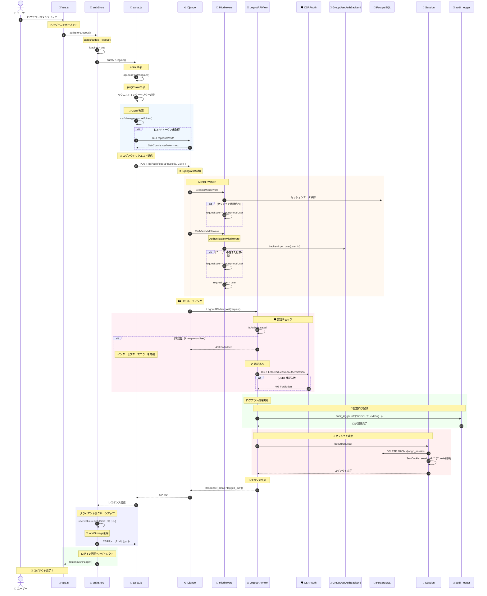

```mermaid
sequenceDiagram
    autonumber
    actor User as 👤 ユーザー
    participant Vue as 🎨 Vue.js
    participant Store as 💾 authStore
    participant Axios as 📡 axios.js
    participant Django as ⚙️ Django
    participant Middleware as 🔄 Middleware
    participant View as 📍 LogoutAPIView
    participant CSRF as 🛡️ CSRFAuth
    participant Backend as 🎯 GroupUserAuthBackend
    participant DB as 💾 PostgreSQL
    participant Session as 🔑 Session
    participant Logger as 📝 audit_logger

    User->>Vue: ログアウトボタンクリック

    Note over Vue: ヘッダーコンポーネント
    Vue->>Store: authStore.logout()

    Note over Store: stores/auth.js - logout()
    Store->>Store: loading = true

    Store->>Axios: authAPI.logout()

    Note over Axios: api/auth.js
    Axios->>Axios: api.post('auth/logout/')

    Note over Axios: plugins/axios.js
    Axios->>Axios: リクエストインターセプター起動

    rect rgb(240, 248, 255)
        Note over Axios: 🔐 CSRF確認
        Axios->>Axios: csrfManager.ensureToken()

        alt CSRFトークン未取得
            Axios->>Django: GET /api/auth/csrf/
            Django-->>Axios: Set-Cookie: csrftoken=xxx
        end
    end

    Note over Axios: 📡 ログアウトリクエスト送信
    Axios->>Django: POST /api/auth/logout/ (Cookie, CSRF)

    Note over Django: ⚙️ Django処理開始

    rect rgb(255, 248, 240)
        Note over Django,Middleware: MIDDLEWARE
        Django->>Middleware: SessionMiddleware
        Middleware->>DB: セッションデータ取得

        alt セッション期限切れ
            Middleware->>Middleware: request.user = AnonymousUser
        end

        Django->>Middleware: CsrfViewMiddleware

        Note over Middleware: AuthenticationMiddleware
        Middleware->>Backend: backend.get_user(user_id)

        alt ユーザー不在または無効
            Middleware->>Middleware: request.user = AnonymousUser
        end

        Middleware->>Middleware: request.user = user
    end

    Note over Django: 🛤️ URLルーティング
    Django->>View: LogoutAPIView.post(request)

    rect rgb(255, 240, 245)
        Note over View,CSRF: 🛡️ 認証チェック
        View->>View: IsAuthenticated

        alt 未認証（AnonymousUser）
            View-->>Django: 403 Forbidden
            Note over Axios: インターセプターでエラーを無視
        end

        Note over View: ✅ 認証済み
        View->>CSRF: CSRFEnforcedSessionAuthentication

        alt CSRF検証失敗
            CSRF-->>View: 403 Forbidden
        end
    end

    rect rgb(240, 255, 240)
        Note over View: ログアウト処理開始

        Note over View,Logger: 📝 監査ログ記録
        View->>Logger: audit_logger.info("LOGOUT", extra={...})

        Logger-->>View: ログ記録完了
    end

    rect rgb(255, 240, 240)
        Note over View,Session: 🔑 セッション破棄
        View->>Session: logout(request)

        Session->>DB: DELETE FROM django_session

        Session->>Session: Set-Cookie: sessionid="" (Cookie削除)

        Session-->>View: ログアウト完了
    end

    Note over View: レスポンス生成
    View-->>Django: Response({detail: "logged_out"})
    Django-->>Axios: 200 OK

    Axios-->>Store: レスポンス受信

    rect rgb(240, 240, 255)
        Note over Store: クライアント側クリーンアップ
        Store->>Store: user.value = null (Piniaリセット)

        Note over Store: 💾 localStorage削除
        Store->>Axios: CSRFトークンリセット
    end

    rect rgb(240, 255, 240)
        Note over Store: ログイン画面へリダイレクト
        Store->>Vue: router.push("Login")
    end

    Note over User,Vue: 🎉 ログアウト完了！
```
