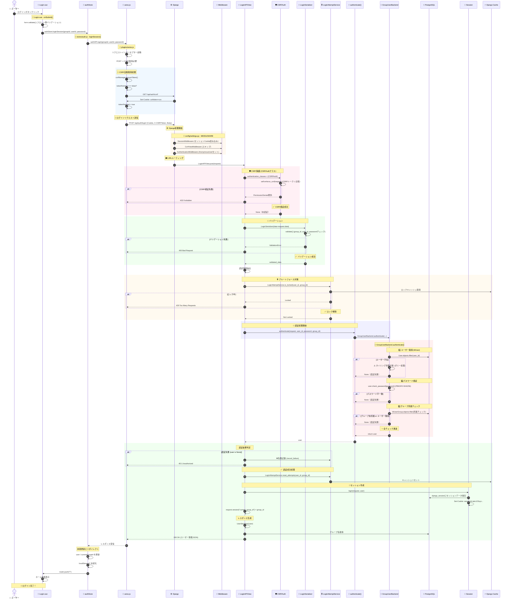

```mermaid
sequenceDiagram
autonumber
actor User as 👤 ユーザー
participant Vue as 🎨 Login.vue
participant Store as 💾 authStore
participant Axios as 📡 axios.js
participant Django as ⚙️ Django
participant Middleware as 🔄 Middleware
participant View as 📍 LoginAPIView
participant CSRF as 🛡️ CSRFAuth
participant Serializer as 📝 LoginSerializer
participant Service as 🔒 LoginAttemptService
participant Auth as 🔐 authenticate()
participant Backend as 🎯 GroupUserBackend
participant DB as 💾 PostgreSQL
participant Session as 🔑 Session
participant Cache as ⚡ Django Cache

    User->>Vue: ログインボタンクリック

    Note over Vue: 📄 Login.vue - onSubmit()
    Vue->>Vue: form.validate() (フロント側バリデーション)

    Vue->>Store: authStore.loginSession(groupId, userId, password)

    Note over Store: 📄 stores/auth.js - loginSession()
    Store->>Axios: authAPI.login(groupId, userId, password)

    Note over Axios: 📄 plugins/axios.js
    Axios->>Axios: リクエストインターセプター起動
    Axios->>Axios: POST -> CSRF取得必要

    rect rgb(240, 248, 255)
        Note over Axios: 🔐 CSRF自動取得処理
        Axios->>Axios: csrfManager.ensureToken()
        Axios->>Axios: tokenFetched === false?
        Axios->>Django: GET /api/auth/csrf/
        Django->>Axios: Set-Cookie: csrftoken=xxx
        Axios->>Axios: tokenFetched = true
    end

    Note over Axios: 📡 ログインリクエスト送信
    Axios->>Django: POST /api/auth/login/ (Cookie, X-CSRFToken, Body)

    Note over Django: ⚙️ Django処理開始

    rect rgb(255, 248, 240)
        Note over Django,Middleware: 📄 config/settings.py - MIDDLEWARE
        Django->>Middleware: SessionMiddleware (セッションCookie読み込み)
        Django->>Middleware: CsrfViewMiddleware (スキップ)
        Django->>Middleware: AuthenticationMiddleware (AnonymousUserセット)
    end

    Note over Django: 🛤️ URLルーティング
    Django->>View: LoginAPIView.post(request)

    rect rgb(255, 240, 245)
        Note over View,CSRF: 🛡️ CSRF保護 (CSRFAuthクラス)
        View->>CSRF: authentication_classes = [CSRFAuth]
        CSRF->>CSRF: self.enforce_csrf(request) (CSRFトークン比較)

        alt CSRF検証失敗
            CSRF-->>View: PermissionDenied例外
            View-->>Axios: 403 Forbidden
        end

        Note over CSRF: ✅ CSRF検証成功
        CSRF-->>View: None（未認証）
    end

    rect rgb(240, 255, 240)
        Note over View,Serializer: 📝 バリデーション
        View->>Serializer: LoginSerializer(data=request.data)
        Serializer->>Serializer: validate() (group_id, user_id, passwordチェック)

        alt バリデーション失敗
            Serializer-->>View: ValidationError
            View-->>Axios: 400 Bad Request
        end

        Note over Serializer: ✅ バリデーション成功
        Serializer-->>View: validated_data
    end

    View->>View: 認証情報抽出

    rect rgb(255, 250, 240)
        Note over View,Service: 🔒 ブルートフォース対策
        View->>Service: LoginAttemptService.is_locked(user_id, group_id)
        Service->>Cache: ロックキャッシュ取得

        alt ロック中
            Service-->>View: Locked
            View-->>Axios: 429 Too Many Requests
        end

        Note over Service: ✅ ロック解除
        Service-->>View: Not Locked
    end

    rect rgb(240, 240, 255)
        Note over View,Auth: 🔐 認証処理開始
        View->>Auth: authenticate(request, user_id, password, group_id)

        Auth->>Backend: GroupUserBackend.authenticate(...)
    end

    rect rgb(255, 240, 240)
        Note over Backend: 📄 GroupUserBackend.authenticate()

        Note over Backend,DB: 1️⃣ ユーザー取得 (MUser)
        Backend->>DB: User.objects.filter(user_id)

        alt ユーザー不在
            Backend->>Backend: ⚠️ タイミング攻撃対策 (ダミー処理)
            Backend-->>Auth: None（認証失敗）
        end

        Note over Backend,DB: 2️⃣ パスワード検証
        Backend->>Backend: user.check_password(password) (PBKDF2-SHA256)

        alt パスワード不一致
            Backend-->>Auth: None（認証失敗）
        end

        Note over Backend,DB: 3️⃣ グループ所属チェック
        Backend->>DB: MUserGroup.objects.filter(所属チェック)

        alt グループ未所属 or ユーザー無効
            Backend-->>Auth: None（認証失敗）
        end

        Note over Backend: ✨ 全チェック通過
        Backend-->>Auth: return user
    end

    Auth-->>View: user

    rect rgb(240, 255, 240)
        Note over View: 認証結果判定

        alt 認証失敗 (user is None)
            View->>Service: ❌ 失敗記録 (record_failure)
            View-->>Axios: 401 Unauthorized
        end

        Note over View,Service: ✅ 認証成功処理
        View->>Service: LoginAttemptService.reset_attempts(user_id, group_id)
        Service->>Cache: キャッシュリセット

        Note over View,Session: 🔑 セッション作成
        View->>Session: login(request, user)

        Session->>DB: django_sessionにセッションデータ保存
        Session->>Session: Set-Cookie: sessionid=abc123xyz...

        View->>View: request.session["current_group_id"] = group_id

        Note over View: レスポンス生成
        View->>View: UserSerializer(user)
        View->>DB: グループ名取得

        View-->>Axios: 200 OK (ユーザー情報JSON)
    end

    Axios-->>Store: レスポンス受信

    Note over Store: 状態更新とリダイレクト
    Store->>Store: user / currentGroupId を更新
    Store->>Store: localStorageに永続化
    Store->>Vue: router.push("/")

    Vue->>Vue: ホーム画面表示

    Note over User,Vue: 🎉 ログイン完了！
```
