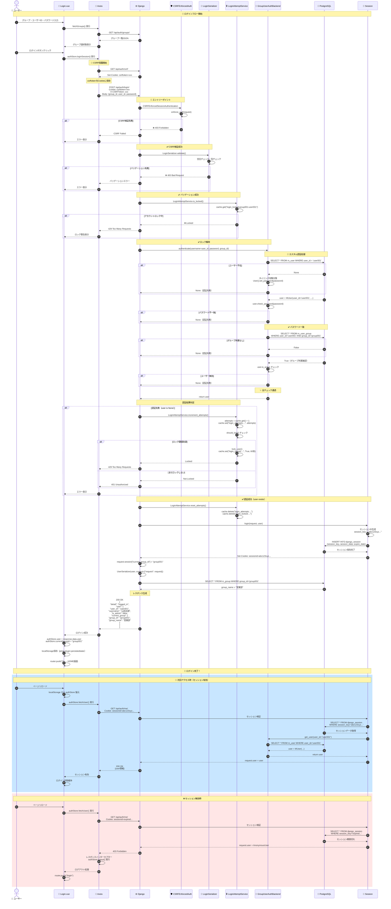

```mermaid
sequenceDiagram
    autonumber
    actor User as 👤 ユーザー
    participant Vue as 🎨 Login.vue
    participant Axios as 📡 Axios
    participant Django as ⚙️ Django
    participant CSRF as 🛡️ CSRFEnforcedAuth
    participant Serializer as 📝 LoginSerializer
    participant Service as 🔒 LoginAttemptService
    participant Backend as 🎯 GroupUserAuthBackend
    participant DB as 💾 PostgreSQL
    participant Session as 🔑 Session

    Note over User,Session: 🚀 ログインフロー開始

    User->>Vue: グループ・ユーザーID・パスワード入力

    Vue->>Axios: fetchGroups() 実行
    Axios->>Django: GET /api/auth/groups/
    Django-->>Axios: グループ一覧JSON
    Axios-->>Vue: グループ選択肢表示

    User->>Vue: ログインボタンクリック
    Vue->>Axios: authStore.loginSession() 実行

    Note over Axios: 🔐 CSRF保護開始
    Axios->>Django: GET /api/auth/csrf/
    Django-->>Axios: Set-Cookie: csrftoken=xxx
    Note over Axios: csrftokenをCookieに保存

    Axios->>Django: POST /api/auth/login/<br/>Cookie: csrftoken=xxx<br/>X-CSRFToken: xxx<br/>Body: {group_id, user_id, password}

    Note over Django,CSRF: 📍 エントリーポイント

    Django->>CSRF: CSRFEnforcedSessionAuthentication
    CSRF->>CSRF: enforce_csrf(request)

    alt CSRF検証失敗
        CSRF-->>Django: ❌ 403 Forbidden
        Django-->>Axios: CSRF Failed
        Axios-->>Vue: エラー表示
    end

    Note over Django,Serializer: ✅ CSRF検証成功

    Django->>Serializer: LoginSerializer.validate()
    Serializer->>Serializer: 空白チェック・型チェック

    alt バリデーション失敗
        Serializer-->>Django: ❌ 400 Bad Request
        Django-->>Axios: バリデーションエラー
        Axios-->>Vue: エラー表示
    end

    Note over Django,Service: ✅ バリデーション成功

    Django->>Service: LoginAttemptService.is_locked()
    Service->>Service: cache.get("login_locked:group001:user001")

    alt アカウントロック中
        Service-->>Django: ❌ Locked
        Django-->>Axios: 429 Too Many Requests
        Axios-->>Vue: ロック警告表示
    end

    Note over Django,Backend: ✅ ロック解除

    Django->>Backend: authenticate(username=user_id, password, group_id)

    Note over Backend,DB: 🎯 カスタム認証処理

    Backend->>DB: SELECT * FROM m_user WHERE user_id = 'user001'

    alt ユーザー不在
        DB-->>Backend: None
        Backend->>Backend: タイミング攻撃対策<br/>User().set_password(password)
        Backend-->>Django: None（認証失敗）
    end

    DB-->>Backend: user = MUser(user_id='user001', ...)

    Backend->>Backend: user.check_password(password)

    alt パスワード不一致
        Backend-->>Django: None（認証失敗）
    end

    Note over Backend,DB: ✅ パスワード一致

    Backend->>DB: SELECT * FROM m_user_group<br/>WHERE user_id='user001' AND group_id='group001'

    alt グループ所属なし
        DB-->>Backend: False
        Backend-->>Django: None（認証失敗）
    end

    DB-->>Backend: True（グループ所属確認）

    Backend->>Backend: user.is_active チェック

    alt ユーザー無効
        Backend-->>Django: None（認証失敗）
    end

    Note over Backend: ✨ 全チェック通過

    Backend-->>Django: return user

    Note over Django,Service: 認証結果判定

    alt 認証失敗（user is None）
        Django->>Service: LoginAttemptService.increment_attempts()
        Service->>Service: attempts = cache.get() + 1<br/>cache.set("login_attempts:...", attempts)
        Service->>Service: should_lock() チェック

        alt ロック閾値到達
            Service->>Service: lock_user()<br/>cache.set("login_locked:...", True, 60秒)
            Service-->>Django: Locked
            Django-->>Axios: 429 Too Many Requests
        else まだロックしない
            Service-->>Django: Not Locked
            Django-->>Axios: 401 Unauthorized
        end
        Axios-->>Vue: エラー表示
    end

    Note over Django,Session: ✅ 認証成功（user exists）

    Django->>Service: LoginAttemptService.reset_attempts()
    Service->>Service: cache.delete("login_attempts:...")<br/>cache.delete("login_locked:...")

    Django->>Session: login(request, user)
    Session->>Session: セッションID生成<br/>session_key = "abc123xyz..."
    Session->>DB: INSERT INTO django_session<br/>(session_key, session_data, expire_date)
    DB-->>Session: セッション保存完了
    Session-->>Django: Set-Cookie: sessionid=abc123xyz...

    Django->>Django: request.session["current_group_id"] = "group001"
    Django->>Django: UserSerializer(user, context={"request": request})
    Django->>DB: SELECT * FROM m_group WHERE group_id='group001'
    DB-->>Django: group_name = "営業部"

    Note over Django: レスポンス生成

    Django-->>Axios: 200 OK<br/>{<br/>  "detail": "logged_in",<br/>  "user": {<br/>    "user_id": "user001",<br/>    "username": "山田太郎",<br/>    "is_admin": false,<br/>    "current_group": {<br/>      "group_id": "group001",<br/>      "group_name": "営業部"<br/>    }<br/>  }<br/>}

    Axios-->>Vue: ログイン成功

    Vue->>Vue: authStore.user = response.data.user<br/>authStore.currentGroupId = "group001"
    Vue->>Vue: localStorage保存（pinia-plugin-persistedstate）
    Vue->>Vue: router.push("/") → HOME画面

    Note over User,Session: 🎉 ログイン完了！

    rect rgb(200, 230, 255)
        Note over User,Session: 🔄 次回アクセス時（セッション有効）
        User->>Vue: ページリロード
        Vue->>Vue: localStorage から authStore 復元
        Vue->>Axios: authStore.fetchUser() 実行
        Axios->>Django: GET /api/auth/me/<br/>Cookie: sessionid=abc123xyz...

        Django->>Session: セッション検証
        Session->>DB: SELECT * FROM django_session<br/>WHERE session_key='abc123xyz...'
        DB-->>Session: セッションデータ取得

        Session->>Backend: get_user(user_id="user001")
        Backend->>DB: SELECT * FROM m_user WHERE user_id='user001'
        DB-->>Backend: user = MUser(...)
        Backend-->>Session: return user

        Session-->>Django: request.user = user
        Django-->>Axios: 200 OK<br/>{user情報}
        Axios-->>Vue: セッション有効
        Vue->>Vue: ログイン状態維持
    end

    rect rgb(255, 230, 230)
        Note over User,Session: ❌ セッション無効時
        User->>Vue: ページリロード
        Vue->>Axios: authStore.fetchUser() 実行
        Axios->>Django: GET /api/auth/me/<br/>Cookie: sessionid=expired...

        Django->>Session: セッション検証
        Session->>DB: SELECT * FROM django_session<br/>WHERE session_key='expired...'
        DB-->>Session: セッション期限切れ

        Session-->>Django: request.user = AnonymousUser
        Django-->>Axios: 403 Forbidden

        Axios->>Axios: レスポンスインターセプター<br/>authStore.logout() 実行
        Axios-->>Vue: ログアウト処理
        Vue->>Vue: router.push("/login")
    end
```
